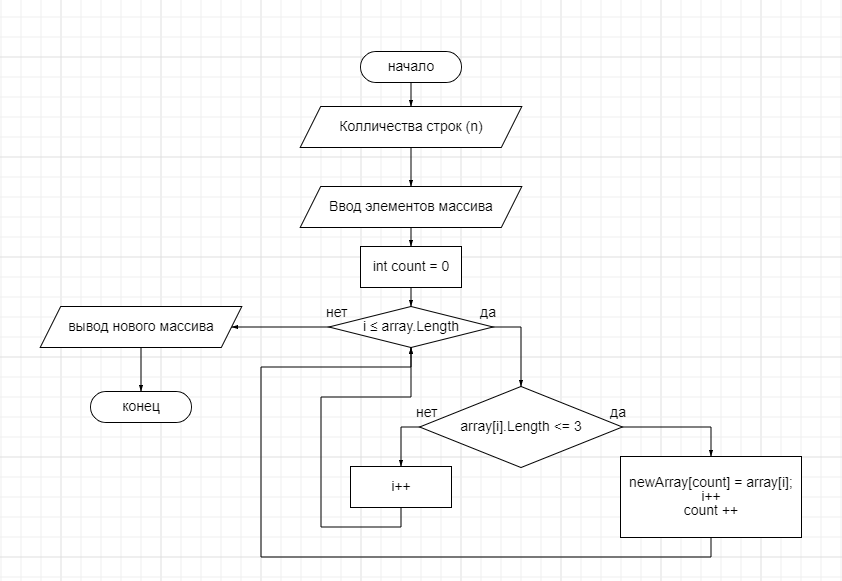

Программа запрашивает у пользователя количество строк в массиве и сам массив строк. Затем производится формирование нового массива, содержащего строки длиной не более трех символов, и выводится на экран. Основная идея алгоритма заключается в том, что для каждой строки исходного массива проверяется ее длина, и если она меньше или равна 3 символам, то она добавляется в новый массив строк. 
